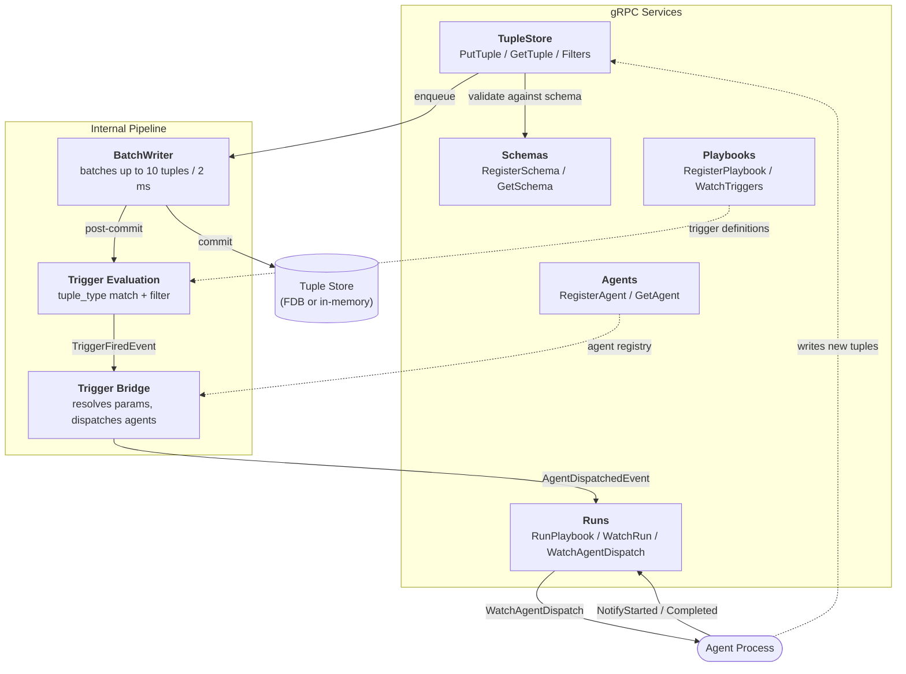

# Tuples

A tuplespace-inspired event store and workflow engine built on FoundationDB.

Tuples are **persistent, write-once, schema-validated JSON objects**. When a
tuple is written, the server evaluates registered triggers and dispatches work to
agents — forming an event-driven orchestration system where data writes
drive computation.

---

## Architecture Overview

The server (`tuplesd`) exposes six gRPC services. Together they implement a
pipeline from tuple writes through trigger evaluation to agent dispatch:



---

## Core Concepts

### Schemas

A **Schema** is a named JSON Schema definition. Every tuple type and every
agent's input parameters reference a schema by name. The server compiles
and caches schemas for fast validation.

### Tuples

A **Tuple** is an immutable, timestamped JSON object:

<table>
<tr><th>Field</th><th>Description</th></tr>
<tr><td><code>uuid7</code></td><td>Server-generated, time-sortable unique ID</td></tr>
<tr><td><code>trace_id</code></td><td>Caller-supplied correlation ID linking related tuples</td></tr>
<tr><td><code>created_at</code></td><td>Server-assigned timestamp (RFC 3339)</td></tr>
<tr><td><code>type</code></td><td>Schema name — data is validated against it on write</td></tr>
<tr><td><code>data</code></td><td>The JSON payload</td></tr>
</table>

For trigger matching, the server flattens a tuple into a single object that
merges `data` with the metadata fields above, so triggers can match on both
payload fields and metadata.

### Filters

A **Filter** defines match rules evaluated against flattened tuple objects:

- **exact** — field must equal a specific value
- **wildcards** — field must exist (any value)
- **predicates** — comparisons (`Gt`, `Lt`, `Gte`, `Lte`, `Regex`, `In`)

Filters are indexed internally using a discrimination tree keyed on exact-match
pairs for fast candidate narrowing.

### Playbooks

A **Playbook** is a named workflow definition containing:

- A **conductor** — the entry-point agent dispatched when the playbook starts
- A list of **agents** referenced by the playbook
- A set of **triggers**, each mapping a tuple pattern to an agent dispatch

Each **Trigger** has two parts:

- **match** — a `tuple_type` (must reference a registered schema) plus an
  optional `Filter` for additional conditions
- **execution** — the agent to dispatch and a parameter mapping where each
  parameter is either a `Literal` value or a `Field` reference extracted from
  the matched tuple

Trigger definitions are validated at registration time: tuple types must exist
as schemas, and `Field` references must name known schema properties or tuple
metadata fields (`uuid7`, `trace_id`, `created_at`, `type`).

### Agents

An **Agent** is a named worker that declares a schema for its input parameters.
Agents are external processes that connect to the server, subscribe to dispatch
events via `WatchAgentDispatch`, perform work, and report back.

### Runs

A **Run** (`PlaybookRun`) tracks the execution of a playbook instance.
Each run has a unique `trace_id` (UUID v7) that correlates all tuples and agent
invocations within that execution.

Within a run, each **AgentRun** tracks an individual agent invocation through
its lifecycle: `Dispatched` &#x2192; `Running` &#x2192; `Completed` | `Failed`.
When all agent runs finish, the overall run transitions to `Completed` or `Failed`.

---

## Data Flow: From Write to Agent Dispatch

Here is how a tuple write propagates through the system:

**1. Client writes a tuple**

```
PutTuple(trace_id="abc", type="order", data='{"item":"widget","qty":5}')
```

The server validates `data` against the `"order"` schema, assigns a UUID v7 and
timestamp, and enqueues the tuple in the **BatchWriter**.

**2. BatchWriter commits and evaluates triggers**

The BatchWriter accumulates tuples (batch size 10, flush timeout 2 ms) and
commits them to storage. After a successful commit, it flattens each tuple
and evaluates every registered trigger:

- Does the trigger's `tuple_type` match the tuple's type?
- Does the trigger's filter match the flattened tuple?

On a match, a `TriggerFiredEvent` is broadcast with the resolved parameters.

**3. Trigger bridge dispatches agents**

The **Executor**'s background trigger bridge task listens for
`TriggerFiredEvent`s. For each event, it checks whether an active
`PlaybookRun` exists with a matching `trace_id`. If so, it resolves
the trigger's parameter mapping against the matched tuple and creates an
`AgentRun` with status `Dispatched`.

**4. Agent receives work and reports progress**

An agent process subscribed via `WatchAgentDispatch` receives the
`AgentDispatchedEvent`, calls `NotifyAgentStarted`, performs its work, then
calls `NotifyAgentCompleted`. The agent may itself write new tuples
(via `PutTuple`), which re-enter the pipeline and may fire further triggers —
creating a chain of reactive computation.

**5. Run completes**

When all `AgentRun`s for a `trace_id` reach a terminal state, the
`PlaybookRun` transitions to `Completed` or `Failed` and a `RunCompletedEvent`
is broadcast to `WatchRun` subscribers.

---

## Example: Order Fulfillment Workflow

This walkthrough sets up a playbook where writing an `order` tuple
automatically dispatches a `fulfil` agent.

### Setup: register schemas, agents, and a playbook

```python
# 1. Register a schema for orders
stub.RegisterSchema(RegisterSchemaRequest(
    name="order",
    definition='{"type":"object","properties":{"item":{"type":"string"},"qty":{"type":"integer"}},"required":["item","qty"]}'
))

# 2. Register a schema for the fulfil agent's parameters
stub.RegisterSchema(RegisterSchemaRequest(
    name="fulfil_params",
    definition='{"type":"object","properties":{"order_id":{"type":"string"},"item":{"type":"string"}},"required":["order_id","item"]}'
))

# 3. Register the conductor and fulfil agents
stub.RegisterAgent(RegisterAgentRequest(
    name="conductor", description="Entry point", schema="order"
))
stub.RegisterAgent(RegisterAgentRequest(
    name="fulfil", description="Ships an order", schema="fulfil_params"
))

# 4. Register a playbook with a trigger
stub.RegisterPlaybook(RegisterPlaybookRequest(definition=json.dumps({
    "name": "order_flow",
    "description": "Fulfil incoming orders",
    "conductor": "conductor",
    "agents": ["conductor", "fulfil"],
    "triggers": [{
        "id": "on_order",
        "match_": {"tuple_type": "order", "filter": {}},
        "execution": {
            "agent": "fulfil",
            "params": {
                "order_id": {"Field": "uuid7"},
                "item":     {"Field": "item"}
            }
        }
    }]
})))
```

### Run: start the playbook and watch events

```python
# 5. Start the playbook run
resp = stub.RunPlaybook(RunPlaybookRequest(
    playbook_name="order_flow",
    params='{"item":"widget","qty":5}'
))
trace_id = resp.trace_id

# 6. In a separate process, the fulfil agent subscribes for work:
for event in stub.WatchAgentDispatch(WatchAgentDispatchRequest(agent_name="fulfil")):
    print(f"Dispatched: run={event.agent_run_id}, params={event.params}")
    stub.NotifyAgentStarted(AgentLifecycleRequest(
        trace_id=trace_id, agent_run_id=event.agent_run_id
    ))
    # ... do fulfillment work ...
    stub.NotifyAgentCompleted(AgentCompletedRequest(
        trace_id=trace_id, agent_run_id=event.agent_run_id, success=True
    ))
```

### Observe: stream run events

```python
# 7. The UI or a monitoring client watches the run
for event in stub.WatchRun(WatchRunRequest(trace_id=trace_id)):
    print(event)
    # AgentDispatchedEvent, AgentStartedEvent, AgentCompletedEvent, RunCompletedEvent
```

---

## Write Durability

`PutTuple` accepts a `guaranteed_write` flag:

- **false** (default) — the call returns as soon as the tuple is enqueued.
  Writes are committed in the next batch flush (~2 ms). Best for throughput.
- **true** — the call blocks until the tuple is durably committed to storage.
  Forces an immediate batch flush. Use when downstream consumers must see the
  tuple before the caller continues.

---

## Services at a Glance

<table>
<tr><th>Service</th><th>Key RPCs</th><th>Purpose</th></tr>
<tr><td><b>Health</b></td><td><code>GetVersion</code></td><td>Connectivity check; returns server version</td></tr>
<tr><td><b>Schemas</b></td><td><code>RegisterSchema</code>, <code>GetSchema</code>, <code>ListSchemas</code></td><td>Manage JSON Schema definitions</td></tr>
<tr><td><b>TupleStore</b></td><td><code>PutTuple</code>, <code>GetTuple</code>, <code>RegisterFilter</code>, <code>MatchTuple</code></td><td>Store tuples, manage and test filters</td></tr>
<tr><td><b>Playbooks</b></td><td><code>RegisterPlaybook</code>, <code>GetPlaybook</code>, <code>WatchTriggers</code></td><td>Manage workflows, stream trigger events</td></tr>
<tr><td><b>Agents</b></td><td><code>RegisterAgent</code>, <code>GetAgent</code>, <code>ListAgents</code></td><td>Register agent workers</td></tr>
<tr><td><b>Runs</b></td><td><code>RunPlaybook</code>, <code>WatchRun</code>, <code>WatchAgentDispatch</code>, <code>NotifyAgent*</code></td><td>Execute playbooks, track lifecycle</td></tr>
</table>

See the individual service pages below for full RPC details, message schemas,
and error codes.
